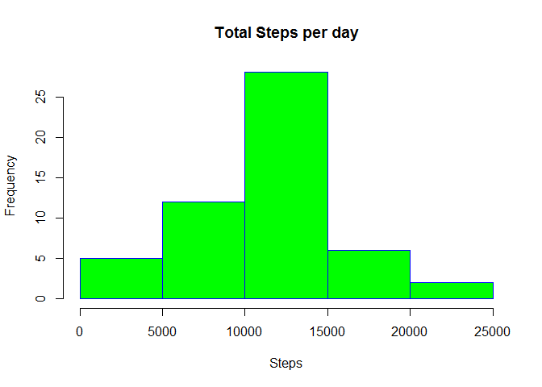
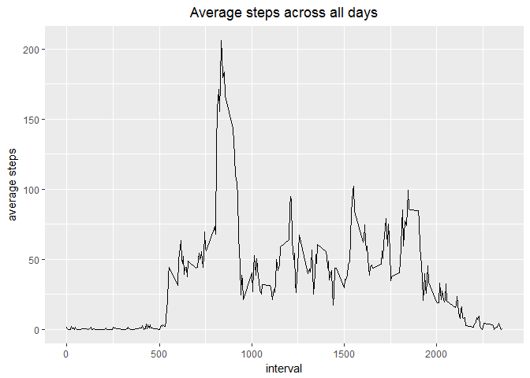
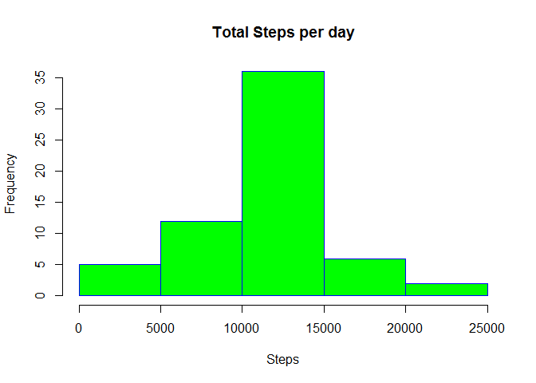
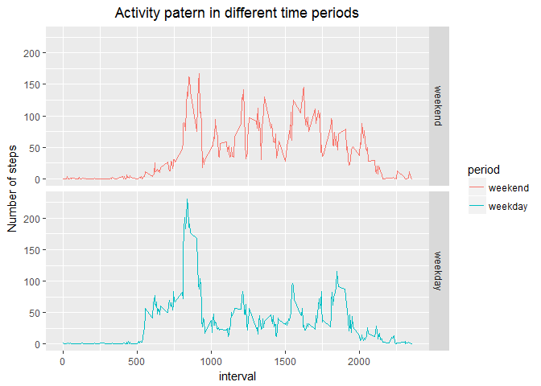

# Reproducible Research: Peer Assignment 1


## Introduction

It is now possible to collect a large amount of data about personal movement using activity monitoring devices such as a Fitbit, Nike Fuelband, or Jawbone Up. These type of devices are part of the “quantified self” movement – a group of enthusiasts who take measurements about themselves regularly to improve their health, to find patterns in their behavior, or because they are tech geeks. But these data remain under-utilized both because the raw data are hard to obtain and there is a lack of statistical methods and software for processing and interpreting the data.

This assignment makes use of data from a personal activity monitoring device. This device collects data at 5 minute intervals through out the day. The data consists of two months of data from an anonymous individual collected during the months of October and November, 2012 and include the number of steps taken in 5 minute intervals each day.

## Loading and preprocessing the data

First load the following libraries and load the file.


```r
library(dplyr)
```

```
## 
## Attaching package: 'dplyr'
```

```
## The following objects are masked from 'package:stats':
## 
##     filter, lag
```

```
## The following objects are masked from 'package:base':
## 
##     intersect, setdiff, setequal, union
```

```r
library(ggplot2)

activity <- read.csv("activity.csv")
```
## What is mean total number of steps taken per day?

1. Calculate the total number of steps taken per day


```r
Steps <- activity %>%
               group_by(date) %>%
               summarise(TotalStepsDay = sum(steps)) 
```

2. The total steps taken per day. The graph is made with the base plot system. 


```r
hist(Steps$TotalStepsDay, xlab = 'Steps', main = 'Total Steps per day', border="blue",     col="green")
```

<!-- -->


```r
meanSteps <- format(mean(Steps$TotalStepsDay, na.rm = TRUE), scientific = FALSE)
medianSteps <- median(Steps$TotalStepsDay, na.rm = TRUE)
```
3. The mean for the total number of steps taken per day is 10766.19. And the median for the total number of steps taken per day is 10765

## What is the average daily activity pattern?

1. Average steps taken:

```r
meanSteps <- activity %>%
               group_by(interval) %>%
               summarise(`average steps` =  mean(steps,na.rm = TRUE))

ggplot(data=meanSteps, aes(x=interval, y=`average steps`)) +
        geom_line() + labs(title="Average steps across all days") +
        theme(plot.title = element_text(hjust = 0.5))
```

<!-- -->

```r
maxSteps <- max(meanSteps$`average steps`,na.rm = TRUE)
```

The maximum number of steps across all days is:206.1698113. 

## Imputing missing values

Note that there are a number of days/intervals where there are missing values (coded as NA). The presence of missing days may introduce bias into some calculations or summaries of the data.


```r
na <- sum(is.na(activity$steps))
```

1. The number of NA's in this dataset is: 2304.

2. I used the meansteps value from the previous step to fill the NA's

```r
temp <- inner_join(activity, meanSteps )
```

```
## Joining, by = "interval"
```

```r
activities <- temp %>%
                mutate(steps = ifelse(is.na(steps),`average steps`,steps)) %>%
                select(steps, date,interval)

totalStepsDay <- activities %>%
                group_by(date) %>%
                summarise(totalSteps = sum(steps))

hist(totalStepsDay$totalSteps, xlab = 'Steps', main = 'Total Steps per day', border="blue",     col="green")
```

<!-- -->

```r
meanSteps <- format(mean(totalStepsDay$totalSteps), scientific = FALSE)
medianSteps <- format(median(totalStepsDay$totalSteps), scientific = FALSE)
```

The mean for the total number of steps taken per day is 10766.19. And the median for the total number of steps taken per day is 10766.19

Do these values differ from the estimates from the first part of the assignment? What is the impact of imputing missing data on the estimates of the total daily number of steps?

Yes, it makes a difference that they now are the same. It means that the data now is evenly devided around the mean. In the previous dataset the data was a bit more diveded to the left side of the histogram.

## Are there differences in activity patterns between weekdays and weekends?


```r
dayName <- c('Monday', 'Tuesday', 'Wednesday', 'Thursday', 'Friday')

weekday <- activities %>%
            mutate(
                date = as.Date(date),
                period = factor(weekdays(date) %in% dayName, 
                              levels = c(FALSE, TRUE), 
                              label = c("weekend", "weekday")
                              )
                ) %>%
        group_by(period, interval) %>%
        summarise(`Number of steps` = mean(steps))

ggplot(weekday, aes(x = interval, y = `Number of steps`, colour=period)) + geom_line() + facet_grid(period ~ .) + ggtitle("Activity patern in different time periods") +  theme(plot.title = element_text(hjust = 0.5))
```

<!-- -->
